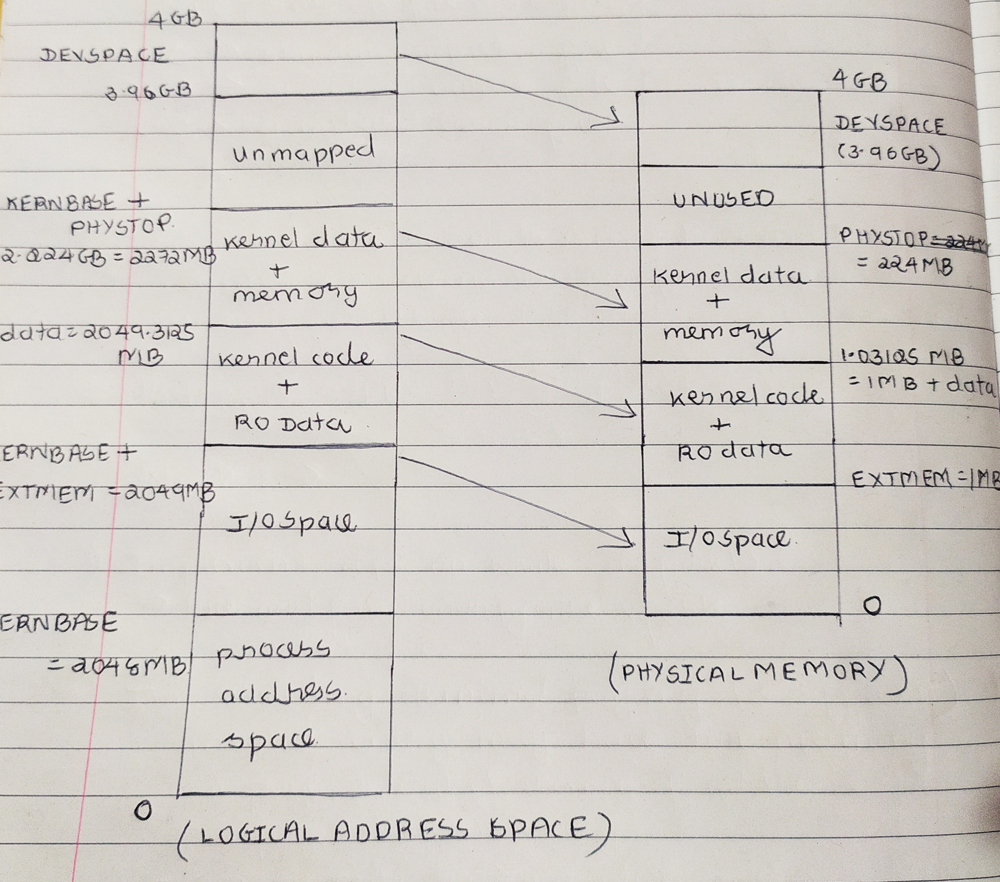

# xv6 KERNEL INIT FUNCTIONS

* The bootmain function after loading the xv6 kernel at location 0x10000 in 
  RAM passes the control to the entry/start function which specified in the ELF 
  file of the kernel image. The last line of the bootmain function 

    ```c
        // Call the entry point from the ELF header.
        // Does not return!
        entry = (void(*)(void))(elf->entry);
        entry();
    ```

* The entry/start function of the kernel is present in the **entry.S** file.
  Note - kernel doesn't start execution from main, but rather starts execution
  from entry assembly language code.

* **Question : where exactly the control is transfered in memory ?**

    + The **kernel.ld** file contains the linker script, which during
      compilation will be interpreted by linker, and links the kernel at the
      memory location 0x80100000 (virtual address)

    + **Note** : there kernel is linked at location 0x80100000, the function 
      the elf->entry() is located at 0x8010000c virtual address. (check **kernel.sym**
      file which is formed after compilation)


## ENTRY FUNCTION (Begining of kernel)

* **Setting up PAGING** for memory management.

    + The in x86 architecture the **PDE / PDT entries** refer to the structure 
      of the entries in two level paging. 
        + First level page entry - Page directory entry (PDE)
        + Second level page entry - Page Table entry (PTE)

    + 

        + For the 4 KB pages 

            ```text
                                            Linear Address (32 bits)
               
                31                      22 21                     12 11                   0
                |___page_directory_index__|_______page_table________|_______offset________|
                            |                         |                        |
                            |                         |                        |
            CR3 ----> +-----------+       +---> +----------+        +----> +----------+
               points |   Page    |       |     |   Page   |        |      |   4 KB   |
                      | Directory |-------+     |   Table  |--------+      |   Page   |
                      +-----------+             +----------+               +----------+

            ```

        + For the 4 MB pages

            ```text
                                            Linear Address (32 bits)
               
                31                      22 21                                             0
                |___page_directory_index__|_____________________offset____________________|
                            |                                     |                       
                            |                                     |                      
            CR3 ----> +-----------+            +-----------> +----------+
               points |   Page    |            |             |   4 MB   |
                      | Directory |------------+             |   Page   |
                      +-----------+                          +----------+
            
            ```
       
    + Setting paritcular **flag in CR4 register**, this turns on **support for 4 MB pages**.

        ```asm
        #define CR4_PSE         0x00000010      // Page size extension
        
        # Entering xv6 on boot processor, with paging off.
        .globl entry
        entry:
            # Turn on page size extension for 4Mbyte pages
            movl    %cr4, %eax
            orl     $(CR4_PSE), %eax
            movl    %eax, %cr4
        ```

    + Setting **pointer to the page directory entries**(PDE) using CR3 register.
        
        ```asm
            # Set page directory
            movl    $(V2P_WO(entrypgdir)), %eax
            movl    %eax, %cr3
        ```

        + The **entrypgdir** is defined in **main.c** file, which is an **array
          of 1024 entries**, and each **entry is 4 bytes**, thus total 1MB or
          1 page memory reserved for the page directory for 1 MB pages.
         
            ```c
                
                #define NPDENTRIES      1024        // # directory entries per page directory
                #define KERNBASE        0x80000000  // First kernel virtual address
                
                // each entry of page directory is 4 bytes 
                typedef uint pde_t;

                // The boot page table used in entry.S and entryother.S.
                // Page directories (and page tables) must start on page boundaries,
                // hence the __aligned__ attribute.
                // PTE_PS in a page directory entry enables 4Mbyte pages.
                
                __attribute__((__aligned__(PGSIZE)))
                pde_t entrypgdir[NPDENTRIES] = {

                    // Map VA's [0, 4MB) to PA's [0, 4MB)
                    [0] = (0) | PTE_P | PTE_W | PTE_PS,

                    // Map VA's [KERNBASE, KERNBASE+4MB) to PA's [0, 4MB)
                    [KERNBASE>>PDXSHIFT] = (0) | PTE_P | PTE_W | PTE_PS,
                };

            ```
            + **Question : where exactly is the location entrypgdir in memory ?**
                + The location of entrypddir can be obtained from **kernel.sym** 
                  file or by using objdump command. Virtual address is 0x80109000
            
            + **Note** : out of total 1024 entries in page directory, entrypddir
              array only 2 are initialized the **entry 0** and **entry 512**, and both 
              are mapped to page frame 0 in actual memory location with following 
              permissions bits set.
                + PTE_P  -> frame persent 
                + PTE_W  -> write permision on frame
                + PTE_PS -> 4 MB page frame
                  
    + Setting particular **flag in CR0 register to turn on paging**

        ```asm
            # Turn on paging.
            movl    %cr0, %eax
            orl     $(CR0_PG|CR0_WP), %eax
            movl    %eax, %cr0
        ```
    + **NOW FINALLY PAGING HAS STARTED**. Thus for every address issued the MMU
       will refer to the Page Directory Table pointed by CR3 regsiter.

    + **COOL STUFF !**
        + The two entries in page directory table are both mapping to the same 
          physical memory location that is frame 0. So effectively any address 
          issued by the CPU will get translated as 0 + offset = offset.
        + Currently **OFFSET == PHYSICAL ADDRESS**
   
* **JUMPING to MAIN kernel function**

    + Before jumping to main function we need to shift to the kernel stack.
      Note the bootloader while loading the kernel would have **loaded the kernel
      stack on the RAM** as it was **specified in the ELF file**.

    + The stack pointer is made to point to the memory location of kernel stack
        ```asm
            # Set up the stack pointer.
            movl $(stack + KSTACKSIZE), %esp
        ```
    + Finally jump to the main function 
        ```asm
            mov $main, %eax
            jmp *%eax
        ```

## MAIN FUNCTION (C code of kernel)

* The things done before this are, the bootloader had set up segmentation table 
  for MMU and loaded the kernel into RAM, the entry function had set up Page
  Directory table of 4 MB for MMU and finally passed control to main function.

    ```text
        start (in bootblock) -> bootmain() -> entry() -> main()
    ```

* The main function is in **main.c** file, which calls a lot of functions
    ```c
        // Bootstrap processor starts running C code here.
        // Allocate a real stack and switch to it, first
        // doing some setup required for memory allocator to work.

        int main(void) {
          kinit1(end, P2V(4*1024*1024)); // phys page allocator
          kvmalloc();      // kernel page table
          mpinit();        // detect other processors
          lapicinit();     // interrupt controller
          seginit();       // segment descriptors
          picinit();       // disable pic
          ioapicinit();    // another interrupt controller
          consoleinit();   // console hardware
          uartinit();      // serial port
          pinit();         // process table
          tvinit();        // trap vectors
          binit();         // buffer cache
          fileinit();      // file table
          ideinit();       // disk 
          startothers();   // start other processors
          kinit2(P2V(4*1024*1024), P2V(PHYSTOP)); // must come after startothers()
          userinit();      // first user process
          mpmain();        // finish this processor's setup
        }
    ```

### KINIT1 FUNCTION (contructor for memory management)

* **kinit1 function** : basically its the **initialization of the OS Memory
  management data structures** which manages the operation over list of free 
  frames on the RAM.

    + kinit1 is called with arguments as
        ```c
            extern char end[]; // first address after kernel loaded from ELF file
            
            #define KERNBASE 0x80000000         // First kernel virtual address
            #define P2V(a) ((void *)(((char *) (a)) + KERNBASE))
            
            kinit1(end, P2V(4*1024*1024)); // phys page allocator
        ```

        * The **end** is global variable initialized by the linker which **points 
          to last address** of the kernel code loaded from ELF file. The virtual
          address pointed by end -> 801154a8

        * **P2V is marco** which converts the phyical address to virtual address,
          basically it adds KERNBASE address value in the physicall address.
            ```
                #define P2V(a) ((void *)(((char *) (a)) + KERNBASE))
            ```
            + **Question : why convert physical to virtual ?**

                + Remember of setting up of Page Directory Table (PDE), before
                  entering the main function of kernel, so now every address
                  issued by CPU passes through the MMU PDE table. Thus now if
                  kernel want's to access any of the physical page address
                  it needs reverse the mapping of virtual to physical addresses.

                + **Work of P2V macro is just to add KERNBASE so that virtual 
                  address issued corresponds to the 512 entry in PDE Table
                  which is corresponds to the frame 0 in physical memory**

    + **kinit1** function definition is given below, which further calls **freerange**
        ```c
            void kinit1(void *vstart, void *vend) {
                freerange(vstart, vend);
            }
        ```
    + **freerange** does the work of actaully freeing all the frames in between
      between the given range of addresses (vstart and vend).
        ```c
            #define PGSIZE          4096    // bytes mapped by a page
                
            void freerange(void *vstart, void *vend) {
                char *p;
                p = (char*)PGROUNDUP((uint)vstart);
                for(; p + PGSIZE <= (char*)vend; p += PGSIZE)
                    kfree(p);
                }
        ```
        + **Questions : what exactly is meant by freeing the frames ? who does it ?**
            + Making frames free is manipulating the OS data structures which
              maintains the free list of frames in memory.
            + kernel memory management function do this job.
              
                 |   function   |           work            | 
                 |--------------|---------------------------|
                 | **kfree**    | free's any given frame    |
                 | **kalloc**   | allocates any free frame  |

    
### KVMALLOC FUNCTION (KERNEL PAGE TABLE)

* Note before entrying the main function of kernel, the page table set up was
  done by **entry routine**, basically setting up **entrypgdir** and settting
  the CR3 register accordingly. This was basically Page Directory Tabel set up 
  (one level paging) for 4 MB pages. 

* Now in **kvmalloc function** which is defined in **vm.c**, The page table
  entry would be changed to constitute 4 KB pages, and setting up **two level
  paging** with **PDE** and **PTE** to reference physical frame in memory.
  Basically the function sets up the page table for the kernel.

    ```c
        typedef uint pde_t;

        /* global pointer to the kernel page directory */
        pde_t *kpgdir;  
        
        void kvmalloc(void) {
            kpgdir = setupkvm();
            switchkvm();
        }
    ```

* **setupkvm** function returns the address of the kernel page directory location.
    ```c
        // Set up kernel part of a page table.
        pde_t* setupkvm(void) {
            
            pde_t *pgdir;
            /* structure which defines two level paging scheme for kernel   */
            struct kmap *k;

            if((pgdir = (pde_t*)kalloc()) == 0) {
                return 0;
            }

            memset(pgdir, 0, PGSIZE);

            for(k = kmap; k < &kmap[NELEM(kmap)]; k++) {
                if(mappages(pgdir, k->virt, k->phys_end - k->phys_start,
                            (uint)k->phys_start, k->perm) < 0) {
                    freevm(pgdir);
                    return 0;
                }
            }

            return pgdir;
        }
    ```
        
    + The setupkvm function attempts to allocate free frame using 
      kernel's kmalloc function, which returns pointer to free frame in memory
      of 4 KB in size.
    
    + The memset function is used to initialize the portion of the memory
      allocated to fixed values like zero.

    + Now next there is loop which initializes the kernel page table entries
      from global array variable called **kmap**, by looping through all
      elements in the array **kmap**.

        ```c
            static struct kmap {
                void *virt;
                uint phys_start;
                uint phys_end;
                int perm;
                } kmap[] = {
                    { (void*)KERNBASE, 0,             EXTMEM,    PTE_W}, // I/O space
                    { (void*)KERNLINK, V2P(KERNLINK), V2P(data), 0},     // kern text+rodata
                    { (void*)data,     V2P(data),     PHYSTOP,   PTE_W}, // kern data+memory
                    { (void*)DEVSPACE, DEVSPACE,      0,         PTE_W}, // more devices
                };  
            }
        ```

        * Note : kmap is global variable which is array of type structure
          named as kmap, defined with data members as
            + virtual address
            + physical start address
            + phyiscal end address
            + permisions 
        
        * Note : **V2P is macro** for translating the virtual to physical addresses 

            ```c
                #define V2P(a) (((uint) (a)) - KERNBASE)
            ```

        * Address values for data members at each index in array of struct kmap

            ```c
                #define EXTMEM  0x100000            // Start of extended memory
                #define PHYSTOP 0xE000000           // Top physical memory
                #define DEVSPACE 0xFE000000         // Other devices are at high addresses

                #define KERNBASE 0x80000000         // First kernel virtual address
                #define KERNLINK (KERNBASE+EXTMEM)  // Address where kernel is linked
            ```

        * The data is global variable which is pointer defined by the linker
          and can be found in the **kernel.sym** file.

          ```text
                80108000 data
          ```

    + Basically what are we trying to achieve by such type of memory mappings
         

        |     region in memory      |       start    |      end      |  size        |   permissions   |
        |---------------------------|----------------|---------------|--------------|-----------------|
        |         I/O space         |    0           | EXTMEM        |   1 MB       |     write       |
        |   kernel code + RO data   |  EXTMEM        | EXTMEM + data |   0.03125 MB |     read        |
        |   kernel data + memory    |  EXTMEM + data | PHYSTOP       |   223 MB     |     write       |
        |        devspace           |  EXTMEM + data | END           |   4 MB       |     write       |

    + **mappages** function does the the work of mapping the entries to get 
       extact page table entries in main memory.

        * Note the parameters passed to the function are 
            + **address of the start of page directory**
            + **starting virtual address**
            + **size of the region**
            + **starting physical address**
            + **permission**

        ```c
            static int mappages(pde_t *pgdir, void *va, uint size, uint pa, int perm) {
                char *a, *last;
                pte_t *pte;

                a = (char*)PGROUNDDOWN((uint)va);
                last = (char*)PGROUNDDOWN(((uint)va) + size - 1);

                for(;;) {
                    if((pte = walkpgdir(pgdir, a, 1)) == 0)
                        return -1;
                    if(*pte & PTE_P)
                        panic("remap");
                    *pte = pa | perm | PTE_P;
                    if(a == last)
                        break;
                    a += PGSIZE;
                    pa += PGSIZE;
                }
                return 0;
            }
        ```

        * The function simply calls **walkpgdir** which checks if there exits
          already page table entry for the particular virtual address, and if
          not then allocates it. After the successful allocation the the
          physical address, permision and present bits are set in the entry.
        
        ```c
            static pte_t *walkpgdir(pde_t *pgdir, const void *va, int alloc) {
                pde_t *pde;
                pte_t *pgtab;

                pde = &pgdir[PDX(va)];
                if(*pde & PTE_P){
                    pgtab = (pte_t*)P2V(PTE_ADDR(*pde));
                } else {
                    if(!alloc || (pgtab = (pte_t*)kalloc()) == 0)
                        return 0;
                    // Make sure all those PTE_P bits are zero.
                    memset(pgtab, 0, PGSIZE);
                    // The permissions here are overly generous, but they can
                    // be further restricted by the permissions in the page table
                    // entries, if necessary.
                    *pde = V2P(pgtab) | PTE_P | PTE_W | PTE_U;
                }
                return &pgtab[PTX(va)];
            }
        ```

        * **Note** : the permission set by the wakepgdir are read and write, although
          the function calling walkpgdir can modify the entry accordingly. Also
          if the alloc is set 1 implies, that the if entry not found in dir it
          will be made in the page directory table.

